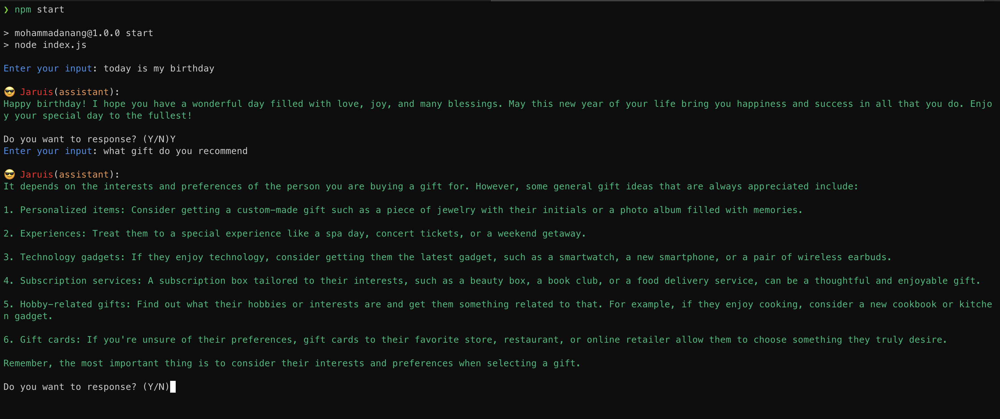

# AI Assitant

This project using Open AI plaform, ChatGPT. You must be register [here](https://platform.openai.com/) to get the `Secret Key`.

## Getting Started

- Open terminal.
- Run `npm install`. (I am using node v18)
- Copy the **secret key** from your OpenAI account page. [here](https://platform.openai.com/account/api-keys)
- Run `cp .env.example`.
- Paste the **secret key** into the `.env` file.
- Run `npm start`.

## Preview Results

