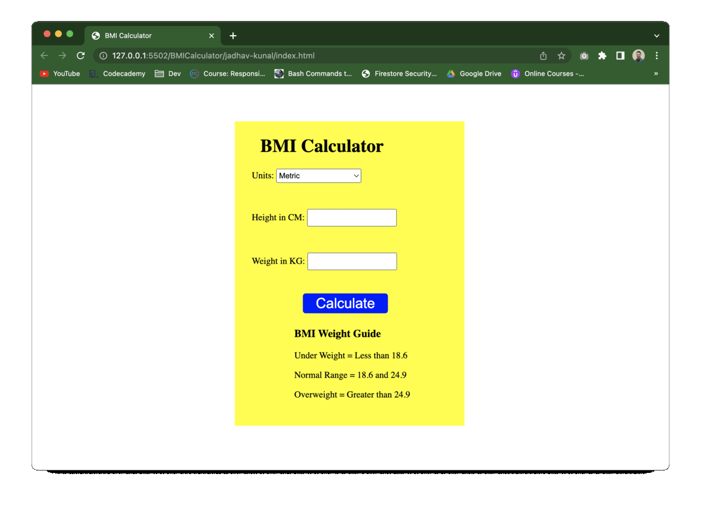

# BMI Calculator

Body mass index (BMI) is a measure of body fat based on height and weight that applies to adult men and women. This application will calculate BMI.

Updated to accept metric or imperial measurements.

