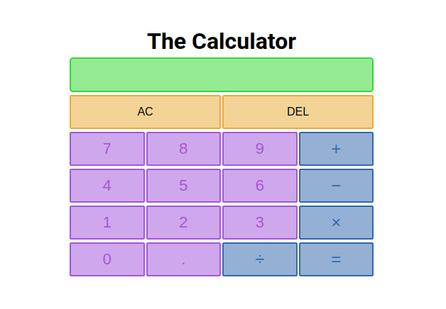

# Calculator
 - A simple calculator using HTML, CSS, and JS  
 - It can calculate some of the basic operations like addition, subtraction, multiplication, and division.  
 - It has validaton to not let the user enter more than one decimal point in one number.  
 - It has validaton to not let the user enter symbols (+, &divide;, &minus;, &times;) right after one another.  

 ## Built using:

 - HTML
 - CSS
 - Javascript 

 ## Screenshot
 
