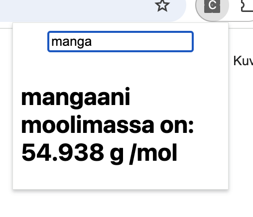

# Chemistry molecular mass calculator

This is chrome extension that helps users check the molacular mass of inputed element from periodic table.

The extension is activated via:

```bash
Alt + U
```

or 

```bash
command + U
```


## Installation

```bash

git clone https://github.com/thinkswell/javascript-mini-projects.git
cd ChemistrySearchExtension/Swifterhtmler/
```

## Demo




## Authors

- [@Swifterhtmler](https://github.com/Swifterhtmler)

## Notes


!! important, the extension currently only works in finnish, but you can modify and translate as you wish !!

