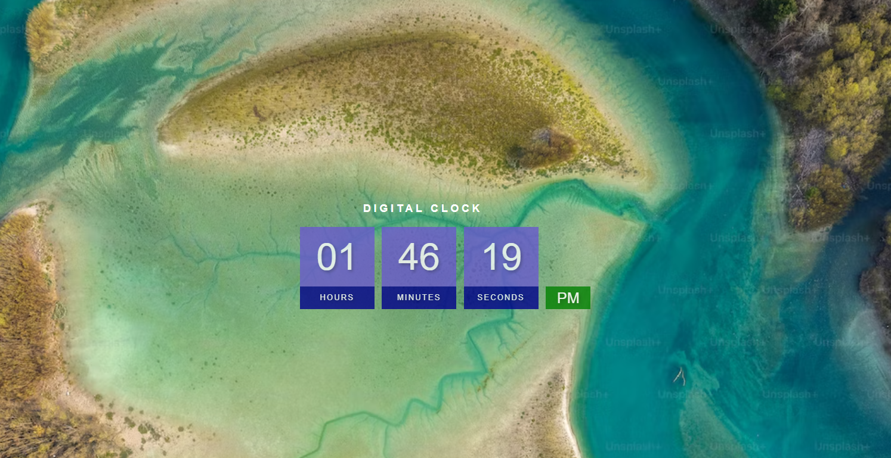

This project is a digital clock which uses basic html, css and js to display a clock on your web browser.
It is very simple to use and setup to display it you just need to click on the html file and it will start.
