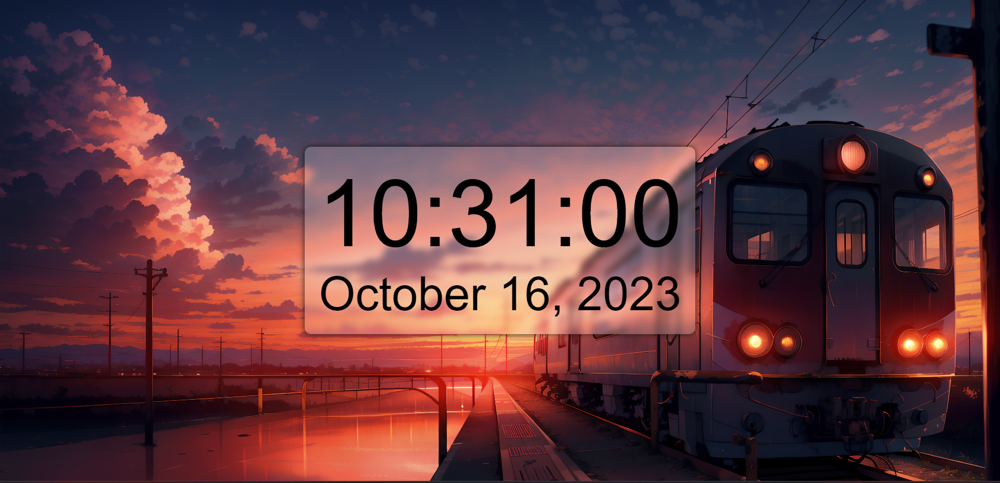

# Digital Clock Project

A simple and professional digital clock created using HTML, CSS, and JavaScript. This clock not only displays the current time but also includes the date, month name, and year. It has a sleek design with smooth animations and a glassy, translucent background.

## Features

- Real-time display of hours, minutes, and seconds.
- Date, month name, and year information.
- Professional styling with a glassy appearance.
- Smooth animations for a polished look.

## How to Use

To use the digital clock, simply open the provided live demo link in your web browser. The clock will automatically display the current time and date.

## Contributing

Contributions are welcome! If you'd like to enhance this project or fix any issues, please feel free to create a pull request.

## Contact

If you have any questions or feedback, please don't hesitate to reach out at [gsaiyashwanth18@gmail.com].

---
<!-- _This project was created by [Yashwanth Varma]._ -->
