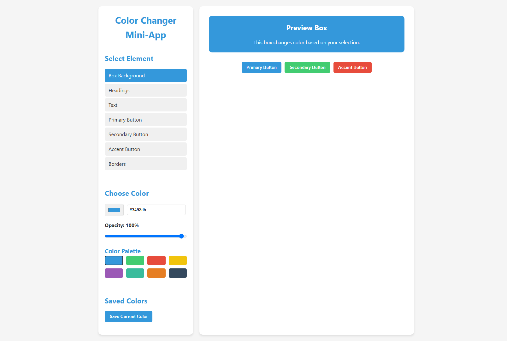

# 🎨 Color Changer Mini-App

A fun and interactive application that allows users to change the color and opacity of various elements on a webpage.



## 🛠 Technologies Used

- **HTML5** - For structure
- **CSS3** - For styling
- **JavaScript** - For functionality
- **jQuery** - For DOM manipulation and events

## ✨ Features

- **Multiple Element Selection:** Change colors of different elements (box background, headings, text, buttons, borders)
- **Individual Opacity Control:** Each element has its own opacity setting
- **Color Selection Methods:**
  - Color picker
  - HEX code input
  - Pre-defined color palette
- **Color Saving:** Save your favorite colors for quick access later
- **Real-time Preview:** See changes in real-time as you adjust colors and opacity
- **Responsive Design:** Works well on different screen sizes

## 🚀 How to Run the Project

### Local Setup

1. Clone the repository

   ```
   git clone https://github.com/yourusername/ColorChanger-MiniApp.git
   ```

2. Open the `index.html` file in your web browser

No server is required to run this project. Simply opening the HTML file in a browser will work.

## 📌 How to Use

1. **Select an Element:** Click on one of the element options in the "Select Element" section (Box Background, Headings, Text, etc.)
2. **Choose a Color:** Use the color picker, enter a HEX code, or click on one of the color swatches in the palette
3. **Adjust Opacity:** Use the opacity slider to set the transparency level for the selected element
4. **Save Colors:** Click the "Save Current Color" button to add the current color to your saved colors list
5. **Apply Saved Colors:** Click on any saved color to apply it to the currently selected element

## 📂 Project Structure

- `index.html` - The main HTML file containing the structure of the application
- `styles.css` - Contains all the styling for the application
- `script.js` - Contains the jQuery code that powers the functionality

## 🔮 Future Improvements

- Add more element types that can be customized
- Implement color scheme export functionality
- Add gradients and pattern options
- Support for RGB and HSL color formats in addition to HEX

## 📜 License

This project is contributed to the JavaScript Mini Projects repository and follows its licensing terms.
