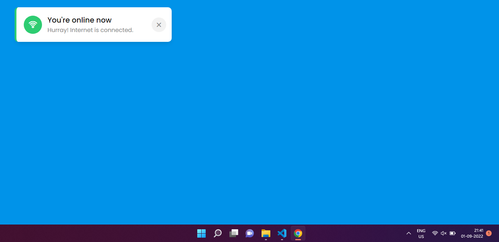

# Internet Connection Detecter using JavaScript

This is a mini project using JavaScript which basically detects Internet Connection and the app is made using JavaScript.
## How to run the app

Just Clone The repo on your machine 

```bash
 and click on the index.js file
```


## FAQ

#### Can I run this online ?

Definitely You can run it at  https://detectinternet.netlify.app/
#### Can I contribute ?

Yeah Definitely. Generate Pull Request Now with your valuable code. 


## Authors

- [@cleverhare](https://www.github.com/cleverhare)


## Screenshots




## 🔗 Links
[](https://detectinternet.netlify.app/)


## Tribute 

Thanks for making this till the end. 

