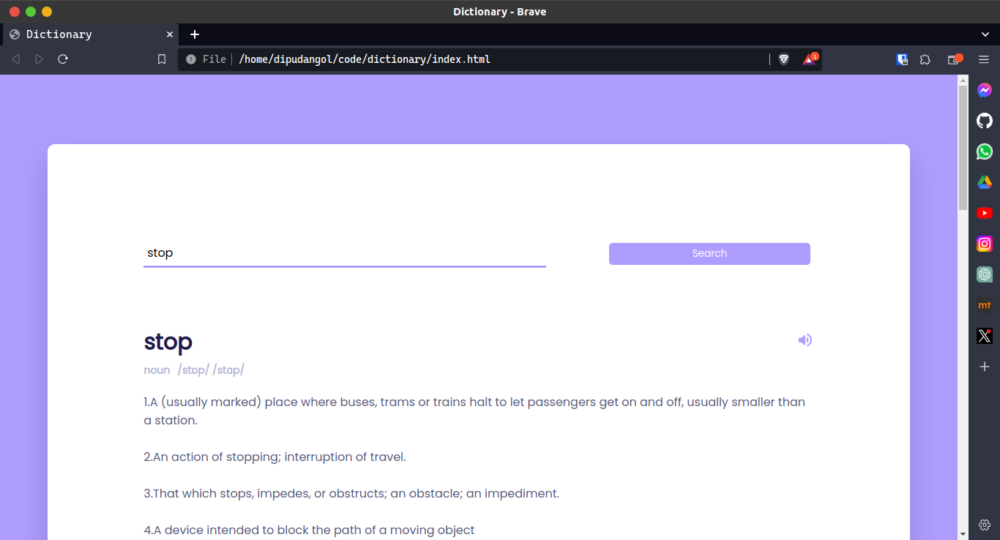

# Dictionary Web App

This is a simple web application for looking up definitions of words. It is built using HTML, CSS, and JavaScript and makes use of a free dictionary API for fetching word definitions.

## Features

- **Word Definitions**: Enter a word and get its definition.
- **Part of Speech**: Along with the definition, the part of speech of the word is displayed.
- **Pronunciation**: The app provides the pronunciation of the word.
- **Usage Example**: It includes an example sentence demonstrating the word's usage.

## How to Use

1. Open the `index.html` file in your web browser.
2. Enter the word you want to look up in the provided input field.
3. Click the "Search" button .
4. The app will display the definition, part of speech, pronunciation, and an example sentence for the entered word.

## Technologies Used

- HTML
- CSS
- JavaScript
- Free Dictionary API (API Endpoint: (https://api.dictionaryapi.dev/api/v2/entries/en/))

## How to Set Up

To run this web app on your local machine, follow these steps:

1. Clone this repository to your local system.
2. Open the `index.html` file in a web browser.
3. You're now ready to use the dictionary web app.
4. You can use this dictionary from dipudangol2.github.io/dictionary 
## API Usage

This web app uses a free dictionary API to fetch word definitions.

## Preview

## Acknowledgements

- The dictionary API used in this project is provided by [Free Dictionary API](https://dictionaryapi.dev/).

## License

This project is licensed under the [MIT License](LICENSE).
