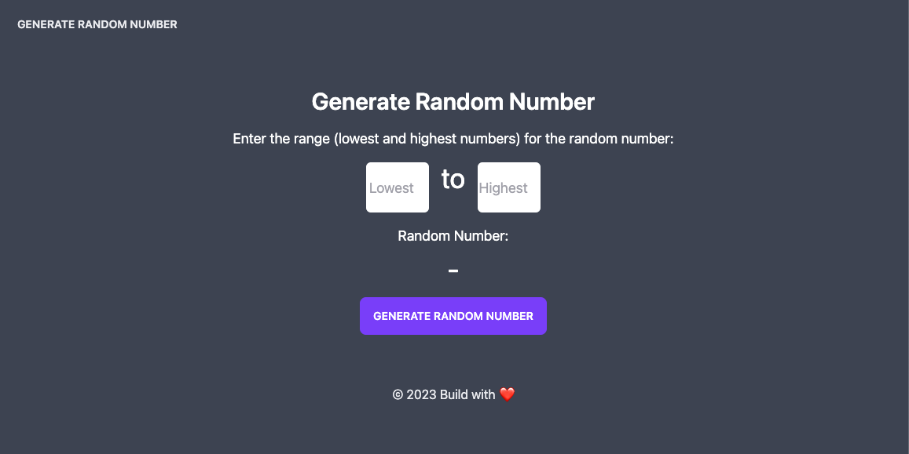

# Generate Random Number

This is a JavaScript program that generates a random number between two numbers. The user can input the number and the program will generate the number between user input.

## How to Use

1. Enter the first number in the first input box.
2. Enter the second number in the second input box.
3. Click the "Generate Random Number" button to generate a random number between the two numbers.
4. The program will display the random number

## Screenshot
