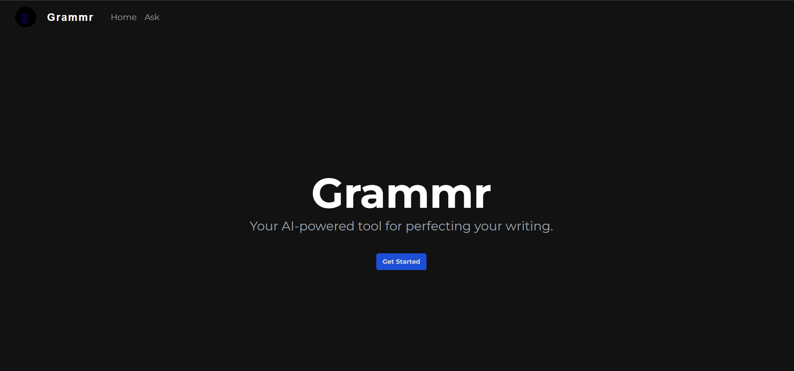

# Grammr

## Project Overview
**Grammr** is a web application built with **Next.js**, **JavaScript**, **Tailwind CSS**, and **Material-UI (MUI)** and **Gemini Api**. 

## Table of Contents
1. [Installation](#installation)
2. [Usage](#usage)
3. [Tech Stack](#tech-stack)
4. [Features](#features)
5. [Contributing](#contributing)
6. [License](#license)

## Screenshots

Here’s a preview of the Grammr interface:


## Installation
To set up the Grammr Checking App, follow these steps:

1. **Clone the Repository**
   ```bash
   git clone https://github.com/sreyas-b-anand/grammr.git
   cd grammr
2. **Install Dependencies**
   - Ensure you have Node.js installed, then run:
   ```bash
   npm install
3. **Run the Application**
   Start the development server:
   ```bash
   npm run dev

## API Integration

To utilize the Gemini API, you'll need to follow these steps to set up your API key:

1. **Obtain Your API Key**
   - Sign up at [Google AI Studio](https://ai.google.dev/api) to obtain your API key.

2. **Set Up Your API Key**
   - Create a `.env.local` file in the root of your project directory if you haven't already.
   - Add your API key to the `.env.local` file:
     ```plaintext
     NEXT_PUBLIC_API_KEY=your_api_key_here
     ```

3. **Install the Gemini API SDK**
   - If you haven't installed it yet, add the Google AI JavaScript SDK to your project:
     ```bash
     npm install @google/generative-ai
     ```

4. **Import the Library and Configure Your Key**
   - In your application code, import the library and configure it with your API key:
     ```javascript
     import { GenerativeAI } from '@google/generative-ai';

     const aiClient = new GenerativeAI({
         apiKey: process.env.NEXT_PUBLIC_API_KEY,
     });
     ```

5. **Make Your First Request**
   - Use the `generateContent` method to generate text:
     ```javascript
     const response = await aiClient.generateContent({
         prompt: "Your prompt here",
         // Other parameters as needed
     });
     console.log(response);
     ```

6. **Restart Your Development Server**
   - After setting up your API key and making changes, restart your development server:
     ```bash
     npm run dev
     ```

Make sure to keep your `.env.local` file secure and do not share it publicly.
 - Access the app in your web browser at http://localhost:3000.
## Tech Stack
 - Next.js: A React framework for server-side rendering and static site generation.
 - JavaScript: The programming language used for building interactive features.
 - Tailwind CSS: A utility-first CSS framework for rapid UI development.
 - Material-UI (MUI): A React UI framework that implements Material Design principles.
## Features
 - Real-time Grammar Correction: Utilizes Gramformer to provide immediate feedback on grammar errors.
 - Responsive Design: Built with Tailwind CSS for a mobile-friendly experience.
 - Customizable Components: Leverages MUI for pre-designed, accessible UI components.
 - Open Source: The application is open for contributions and improvements.

## Contributing
 - Contributions are welcome! Please follow these steps:
 
## License
 - This project is licensed under the MIT License - see the LICENSE file for details.
