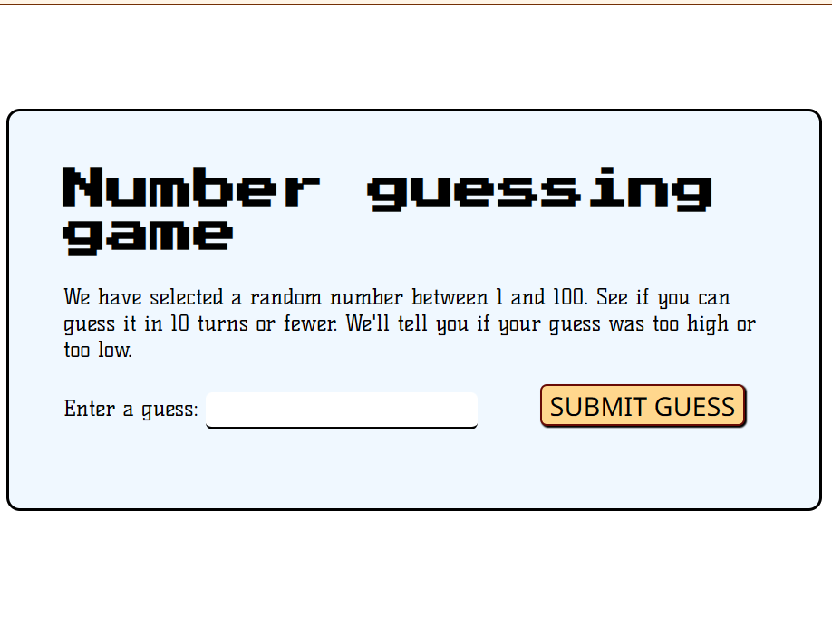

# Number Guessing Game

## Overview
The **Number Guessing Game** is a simple yet engaging interactive program that challenges users to identify a randomly generated number between **1 and 100** within **10 attempts**. The game provides instant feedback to help users refine their guesses. The game ends when the number is correctly guessed or when all attempts are used up, with an option to restart and play again.

## Features
- 🎲 **Random Number Generation** - A new number is generated for every session.
- 🔍 **Feedback System** - Displays whether the guess is too high, too low, or correct.
- 📋 **Previous Guesses** - Keeps track of past attempts for better decision-making.
- 🔄 **Game Reset Functionality** - Allows users to start a new game without refreshing the page.
- 🎨 **User-Friendly Interface** - A visually appealing and responsive design for an enjoyable experience.
- 📱 **Mobile Compatibility** - Adjusts layout and usability across different screen sizes.

## Files Included
- 📄 `index.html` - The main HTML file that structures the game’s layout.
- 🎨 `style.css` - The stylesheet that controls the visual design.
- 📜 `script.js` - JavaScript code that handles game logic and user interaction.
- 📜 `LICENSE` - Information on permissions and usage rights.
- 📄 `icons8-close.svg` - A close button icon used in modal elements.

## How to Play
1. 🖥️ Open `index.html` in a web browser.
2. 🔢 Enter a guess (between 1 and 100) in the input field.
3. 🎯 Click **SUBMIT GUESS** to check your input.
4. 📊 The game will indicate if the guess is too high, too low, or correct.
5. ⏳ Keep guessing until either:
   - You find the correct number 🎉
   - You reach the maximum of 10 attempts and see a **Game Over** message 😞
6. 🔄 Click **Start New Game** to reset and play again.

## Technologies Used
- 🌐 **HTML** - Defines the structure of the webpage.
- 🎨 **CSS** - Styles the game interface and enhances user experience.
- ⚡ **JavaScript** - Controls game logic, user interaction, and animations.

## Additional Enhancements
- 🏃‍♂️ **Smooth Animations** - Enhances the look and feel of the game.
- 🎭 **Interactive Elements** - Buttons and inputs respond dynamically to user actions.
- 🔍 **Input Validation** - Ensures guesses are within the allowed range.
- 📏 **Responsive Design** - Adapts to different screen sizes for an optimal experience.

## Future Enhancements
- 🔊 **Sound Effects** - Add feedback sounds for winning, losing, and incorrect guesses.
- 🎚️ **Difficulty Levels** - Allow players to choose different number ranges.
- 🏆 **Leaderboard System** - Track and display top scores and attempts.
- 🌍 **Multiplayer Mode** - Compete with friends in a turn-based challenge.

## Author
Developed by **Mayank Raj**.
For more projects, visit [GitHub Profile](https://github.com/mayank-0103).

## License
This project follows the terms specified in the `LICENSE` file.