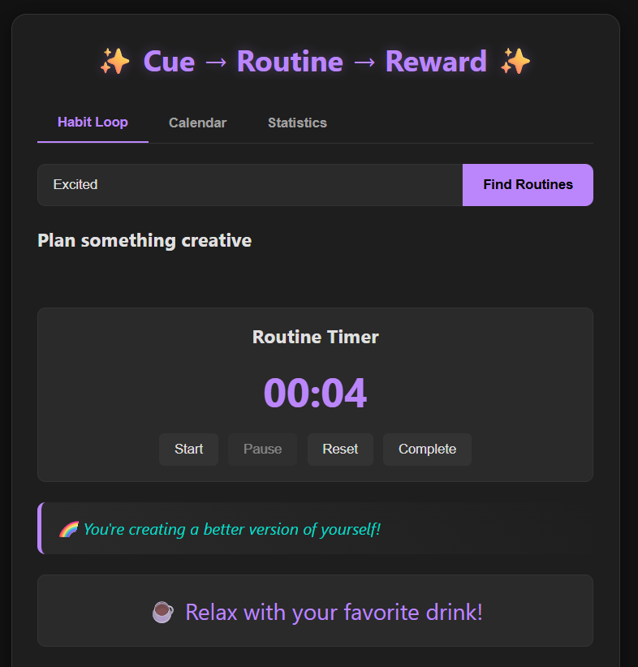

# Habit Loop Visualizer

A simple JavaScript mini project that visualizes the **Habit Loop** cycle:  
**Cue → Routine → Reward**

This project demonstrates how habits are formed and maintained using an interactive visualization.

---

## 🚀 Features
- Interactive UI to show the habit loop stages  
- Visual transitions between **Cue → Routine → Reward**  
- Clean design using HTML, CSS, and JavaScript  
- Easy to extend for additional customization  

---

## 📂 Project Structure
HabitLoopVisualizer/
│── index.html # Main HTML file
│── style.css # Styling for the visualizer
│── script.js # JavaScript logic
│── README.md # Project documentation 

## 🛠️ How to Run
1. Clone or download this repository.  
2. Navigate to the `HabitLoopVisualizer` folder.  
3. Open `index.html` in your browser.  

That’s it — no additional setup required! 🎉  

---

## 🎯 Preview
Here’s how the Habit Loop Visualizer looks in action:  

## 🤝 Contribution
Feel free to fork this project and enhance it — add animations, more loops, or a dashboard for tracking multiple habits.  