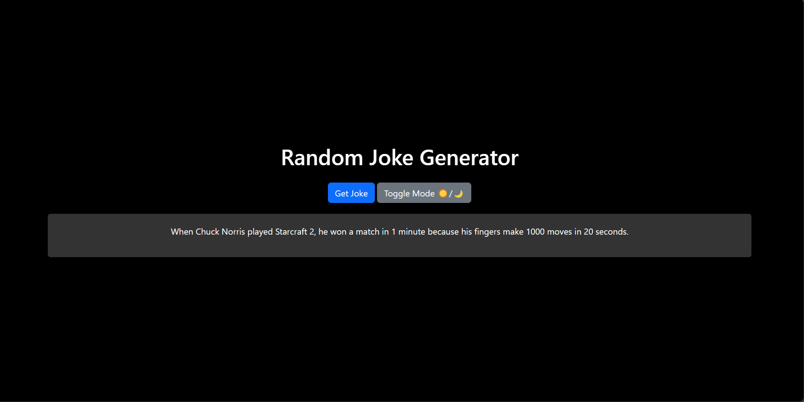

Summary
This simple web app displays random jokes with a stylish dark mode toggle. Users can click a button to get a new joke, and switching to dark mode transforms the background and joke container to a sleek black theme for an enjoyable user experience. Users can easily switch between light and dark modes for an entertaining and visually appealing joke-telling experience

SCREENSHOTS:

