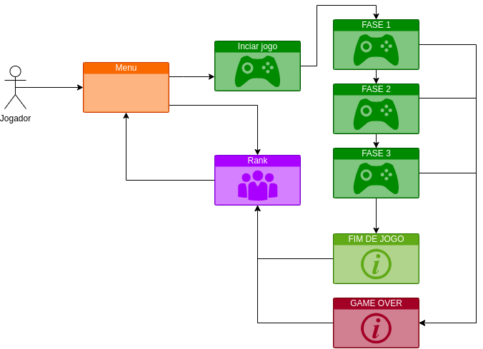

# MA

- https://minha-terra.herokuapp.com/

## Motivação
Desenvolvimento de um jogo casual

## Objetivo
Uma invasão alienígena começou no planeta terra e você foi escolhido para a missão de proteger o planeta dessa grande ameaça.

## Fases
O jogo possui 4 fases e de inimigos que viram uma após a outra tendo o aumento da dificuldade

| Fases | Descrição                                                    |
| :---: | ------------------------------------------------------------ |
| 1 | Uma onda de inimigos leves para vocês destruir |
| 2 | Uma onda de inimigos que se movimentão até o solo |
| 3 | Uma onda de inimigos que se move aleatoriamente no mapa para todas as direções |
| 4 | Um único inimigo com mais vida |

## Esquema de Pontuação
Ganhar pontos ao destruir os inimigos, após o final do game você salva sua pontuação em um rank

## Requisitos

#### Épicos/Funcionalidades

1. **Exibir tela de abertura com opção de menu**
   A aplicação exibe uma tela com informações do game e opção de menu.

2. **Exibir tela do jogo**
   A aplicação exibe a tela principal do jogo

3. **Exibir tela de ranking**
   A aplicação exibe uma tela contendo os pontos obtidos pelo jogar e disponibiliza um ranking.

4. **Exibir tela de controles**
   A aplicação exibe uma tela para o jogador testar os controles do jogo
   
5. **Exibir tela de sair**
   A aplicação exibe a página do github.

#### Personas

1. **Jogador** - usuário com acesso a um navegador web, que gosta de jogar games no computador.

## Protótipos de Tela
