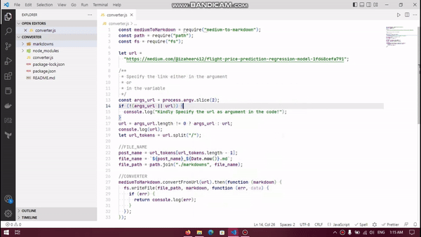

# Markdown Image Hosting

Parse your medium link and convert it to markdown.

## Description

Wanna convert your medium post to markdown for posting it on another platform? This lib will help you do so 😃.

## Getting Started

### Dependencies

- medium-to-markdown

### Installing

Install the app. It will install all your dependencies.

```
npm install
```

Start the app and specify the medium post link in the arguments or in the variable hardcoded.

```
npm start https://medium.com/@izaheer612/flight-price-prediction-regression-model-1fd68cefa791
```

OR

```js
let url =
  "https://medium.com/@izaheer612/flight-price-prediction-regression-model-1fd68cefa791";

/**
 * Specify the link either in the argument
 * or
 * in the variable
 */
```

The parser will parse the post link and `medium-to-markdown` will convert it to markdown.



## License

This project is licensed under the [MIT] License - see the LICENSE.md file for details
