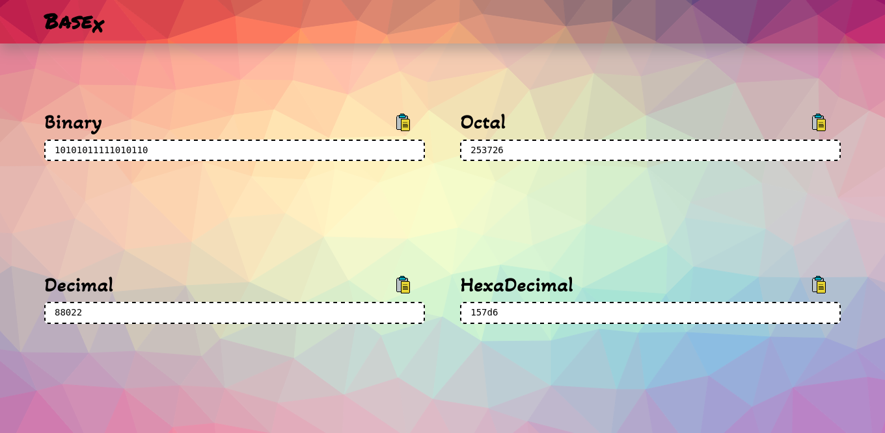
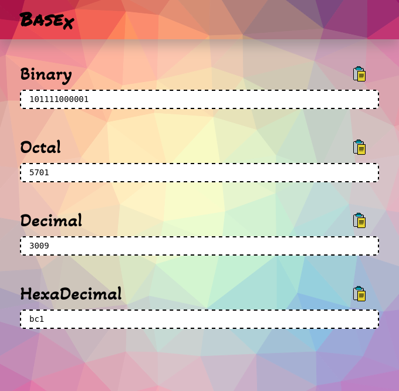
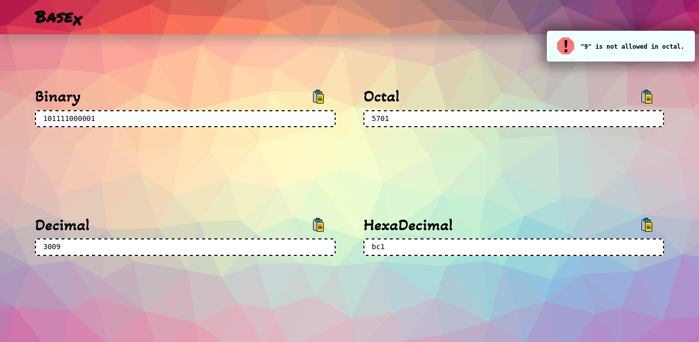

# BaseX
## Number System Converter
#### This app interconverts binary, ocatal, decimal and hexadecimal numbers.

#

## BaseX In Action

#

## Features

### Responsive design

### Invalid character handling

### Copy text feature

