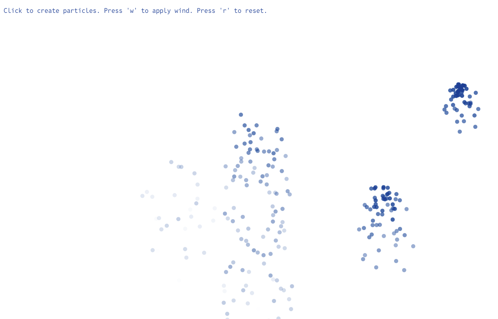

# Particle System Sketch

This project is a particle system simulation created using the p5.js library. Users can interact with the system by creating particles with mouse clicks, applying wind with the 'w' key, and resetting the system with the 'r' key.

### Features
- **Create Particles**: Click anywhere on the canvas to create a burst of particles.
- **Apply Wind**: Press the 'w' key to apply a wind force to all particles.
- **Reset**: Press the 'r' key to reset the particle system and start fresh.

### Getting Started
1. Clone this repository to your local machine.
2. Open the provided HTML file in a web browser.
3. Have fun 

### Technical Info
- **Framework**: None
- **Library**: [p5.js](https://p5js.org/)
- **Language**: JavaScript, HTML, CSS

