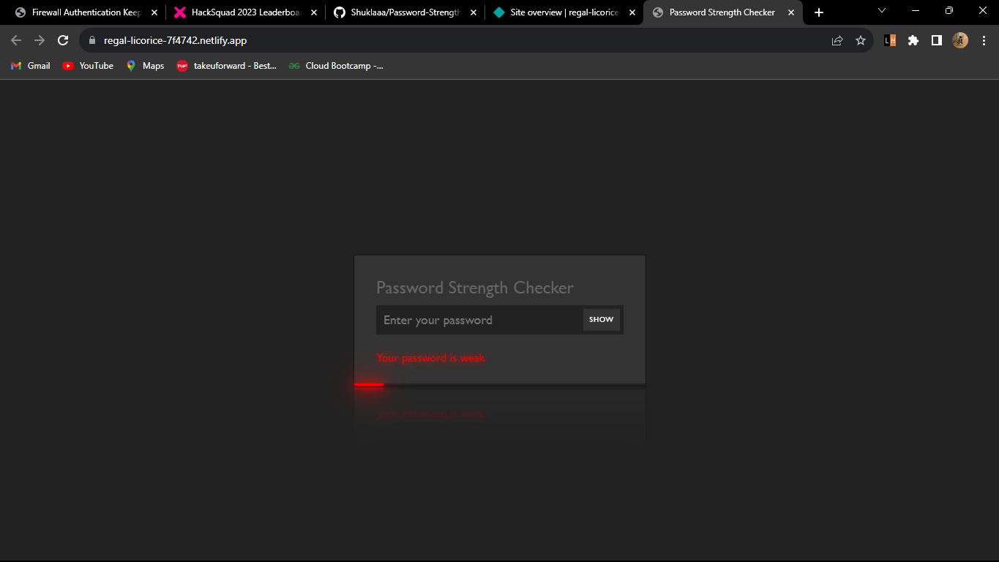
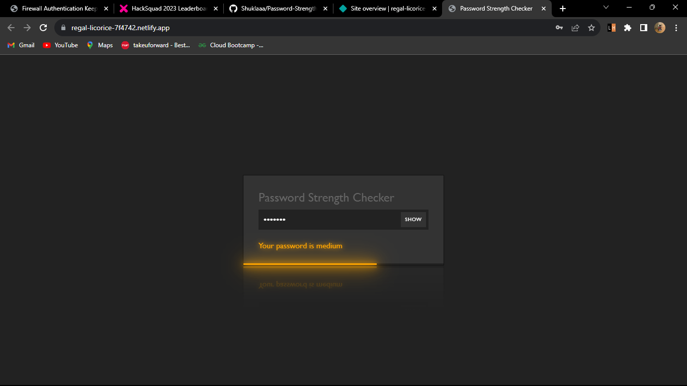
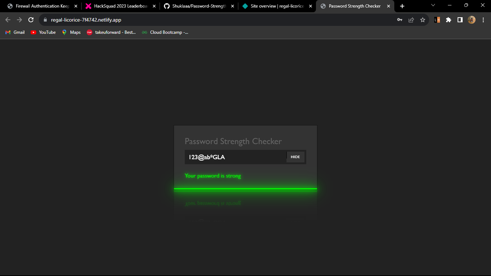

#PASSWORD STRENGTH CHECKER

##Overview
The Password Strength Checker is a web application built using HTML, CSS, and JavaScript. It provides a user-friendly interface for assessing the strength of passwords. Users can input a password, and the application will evaluate its strength based on various criteria.

##Features
- Password Input: Users can enter a password into the application.
- Strength Evaluation: The application assesses the strength of the password based on criteria such as length, complexity, and character types.
- Strength Indicator: A visual or textual indicator is provided to show the strength of the password (e.g., Weak, Medium, Strong).
- User-Friendly: The interface is designed to be user-friendly and intuitive, making it easy for users to understand the strength of their passwords.
- Styling and Presentation: The application is styled with CSS to ensure a pleasant and visually appealing user experience.

##SCREENSHOTS

