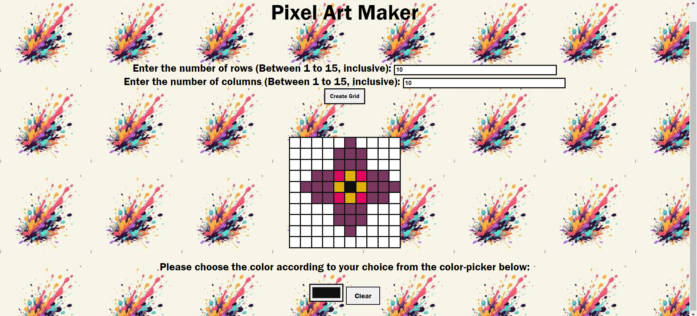

# **Game_Name** 

Pixel_Art_Maker

 

## **Description 📃**

- This is a mini app, where one can easily create any pixelated art using various colours.

## **Languages **

- HTML5, CSS3 and JS is used in making this application.

## **functionalities 🎮**

- This game features a customisable grid, where the user can choose the number of rows and columns for their art. This customisability helps users to create pixel-arts as per their choice neatly.
- This game also features a color-picker, with the help of which, a user can very easily customise the color to be used in their painting.
- There is also a clear button, which helps the user to create as many pixel-art as wanted in a single go only.
 

## **How to play? 🕹️**

- The user has to enter the number of rows and columns that they would require in their art and then click the create-grid button.
- A blank grid appears.
- The user now has to click on the black color-picker box under the grid.
- A color-picker box appears, the user can choose any color from the spectrum.
- On pressing the clear button, th art is removed and the user gets back the original blank screen.

 

## **Screenshots 📸**

 

 