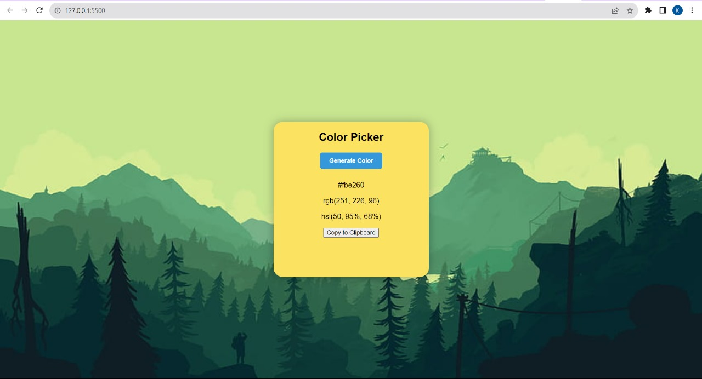

# Color Generator App

A simple web application that generates random colors and provides their HEX, RGB, and HSL values.

## Features

- Generates random colors with HEX, RGB, and HSL values.
- Allows copying color values to the clipboard.
- Displays a history of generated colors.

- [ ] Followed guidelines mentioned in the readme file.
- [ ] Followed directory structure. (e.g. ProjectName/{USERNAME}/...yourfiles)
- [ ] Starred ⭐ the Repo (Optional)