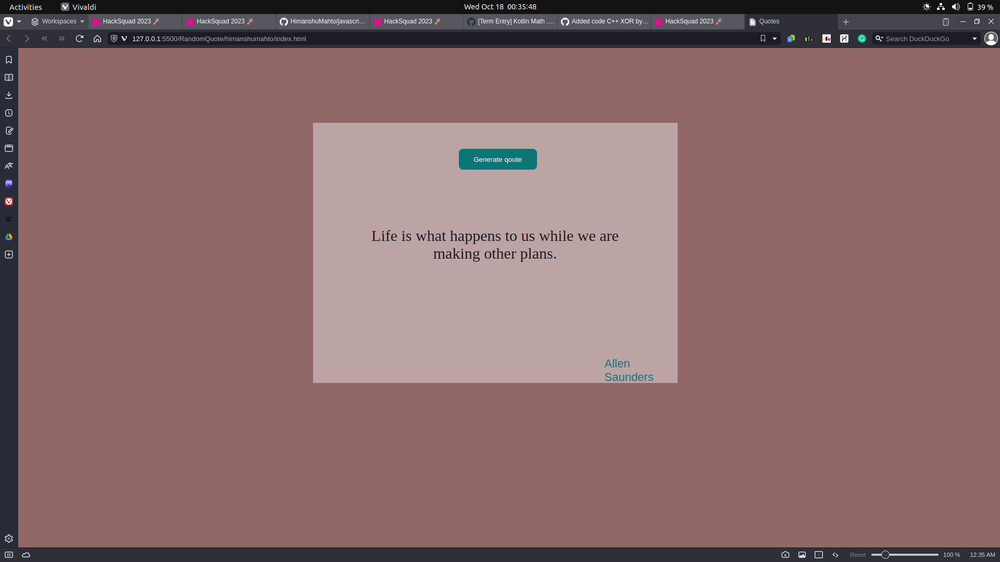

# JavaScript Quote Generator

This is a simple web app built with HTML, CSS, and JavaScript that generates random quotes on different themes. The app allows you to fetch and display quotes from various themes, change the background color, and apply animations to the quote container.

## Features

- Randomly fetch and display quotes from different themes.
- will work when you click the quote button.

## Screenshots

