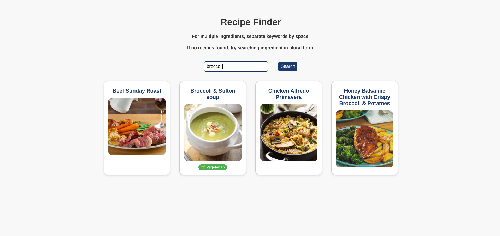

# RecipeFinder

A simple and clean **Recipe Finder** web application that lets users search for meals by ingredients. It also highlights whether recipes are vegetarian without needing to click and open each one. Built as a contribution to the JavaScript Mini Projects collection.

---

##Features

- Search recipes by one or more ingredients
- Displays image cards of matching recipes
- Click any card to view full instructions and ingredient list
- Vegetarian-friendly: automatically flags recipes
- Responsive layout and smooth user experience
- Enter and Escape key shortcuts for quick interaction

---

##Tech Stack

- *Language*: HTML, CSS, JavaScript
- *API Used*: [TheMealDB](https://www.themealdb.com/)

---

##API Information

This project uses [TheMealDB](https://www.themealdb.com/) which is a free and public API — **no API key is required**. You can directly query endpoints like:

- `https://www.themealdb.com/api/json/v1/1/filter.php?i=ingredient`
- `https://www.themealdb.com/api/json/v1/1/lookup.php?i=mealID`

---

##How to Run Locally
- Clone the repository, eg. in bash:
	git clone https://github.com/your-username/javascript-mini-projects.git
	cd javascript-mini-projects/RecipeFinder/shivt-F5
- Open the app:
	Open RecipeFinder.html in your browser
