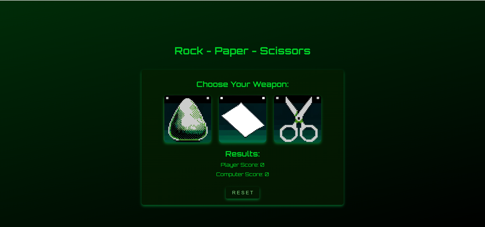

Rock Paper Scissors Game - Retro and Responsive
Description:

This project is a classic Rock Paper Scissors game where the user plays against the computer to win, lose or tie. The interface is old school and retro style for a classic feel to the game. This projects utilises HTML, CSS and JavaSript.

Screenshot

Features

- Old school retro style interface, that is user-friendly, clear and entertaining

- Single-player mode - player vs computer

- Score tracking

- Reset Button to set the scores back to 0

- Responsive to smaller screens and devices

How to play

1. Load the game onto your browser of of choice.

2. Choose your between rock, paper, or scissors.

(rock beats scissors, paper beats rock and scissors beats paper. If the computer and player draw the same it is a tie, so no one will score)

3. Who ever wins will score a point. Game continues for as long as user wants to play.

4. To play from the beginning user can press the rest button.

Contributing
All contributions are welcome to this project.

