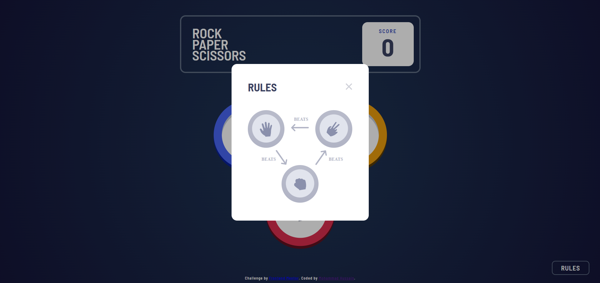
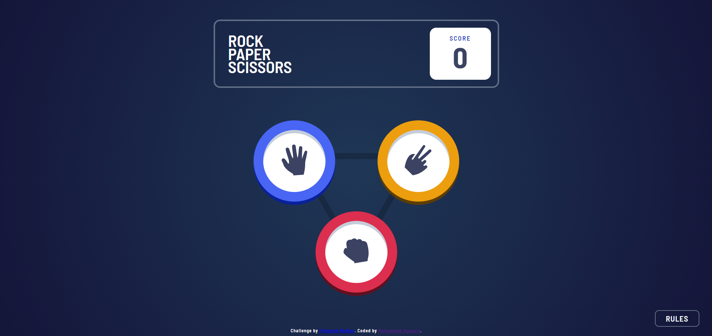
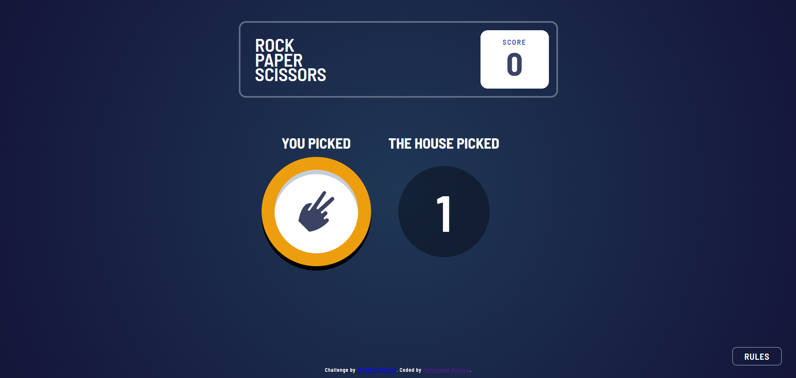
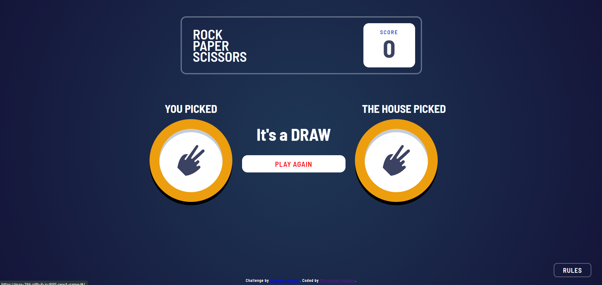

### This project was bootstrapped with [Create React App](https://github.com/facebook/create-react-app).

## Rock-paper-scissors-master challenge 
This challenge was given by [Frontend Mentor](https://www.frontendmentor.io/challenges/rock-paper-scissors-game-pTgwgvgH/hub/rock-paper-scissors-game-we9VibGQIa)

# How to Play

- 1) Look at the rules by tapping RULES button at bottom right corner
    
- 2) Now choose one from 3 choices to begin the Game
    
- 3) Wait for The House to choose 
    
- 4) If you Win then score will increase by one if you loose it will decrease by one else nothing changes
    
- 5) Play Again!

## Technologies Used
**HTML,CSS,JS**
**Reactjs,React-router etc.** 

