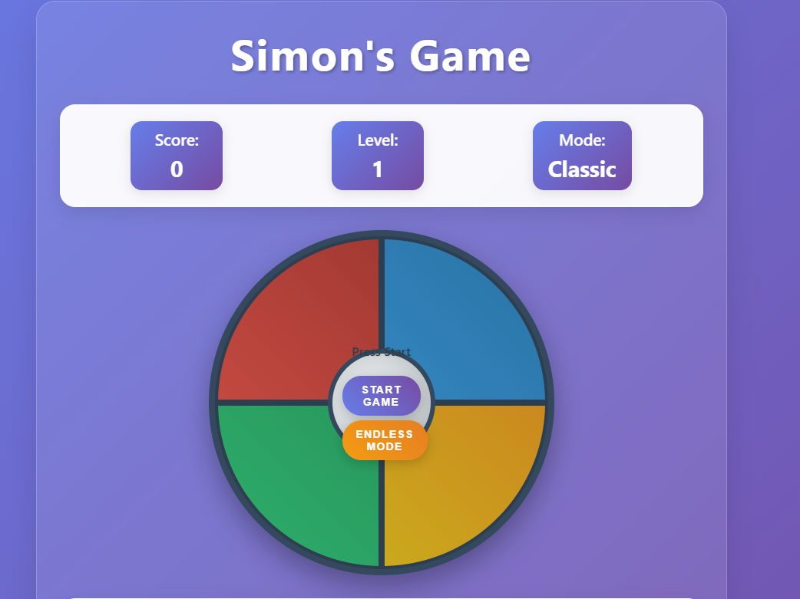

# Simon's Game 🎮

A simple and easy-to-understand implementation of the classic Simon's memory game built with HTML, CSS, and JavaScript.

## Sample Working Output 📸



*The game features a modern glass morphism design with four colored buttons arranged in a circle, score display, and intuitive controls.*

## Features ✨

- **Simple Code**: Easy to read and understand for beginners
- **Classic Mode**: Traditional Simon's game with increasing difficulty
- **Endless Mode**: Keep playing as long as you can
- **Audio Support**: Custom sounds for each color and game over
- **Speed Control**: Adjust how fast the pattern plays
- **Volume Control**: Adjust audio volume
- **Responsive Design**: Works on desktop and mobile

## How to Play 🎯

1. **Start the Game**: Click "Start Game" or "Endless Mode"
2. **Watch the Pattern**: The game shows you a sequence of colors
3. **Repeat the Pattern**: Click the colors in the same order
4. **Progress**: Each level adds one more color
5. **Score Points**: Earn points based on your level

## Audio Files Required 🔊

Add these audio files to the same folder:

- `sound1.mp3` - Red button sound
- `sound2.mp3` - Blue button sound  
- `sound3.mp3` - Green button sound
- `sound4.mp3` - Yellow button sound
- `GameOver.mp3` - Game over sound

## Controls 🎮

- **Mouse**: Click colored buttons to play
- **Sliders**: Adjust speed and volume
- **Buttons**: Start, Endless Mode, Reset

## Game Modes 🎲

### Classic Mode
- Game ends when you make a mistake
- Try to get the highest score

### Endless Mode
- No game over - keep playing forever!
- Perfect for practice

## Code Structure 📁

```
Panvish/
├── index.html      # Simple HTML structure
├── style.css       # Clean CSS styles
├── main.js         # Easy-to-read JavaScript
├── README.md       # This file
├── sound1.mp3      # Red button audio
├── sound2.mp3      # Blue button audio
├── sound3.mp3      # Green button audio
├── sound4.mp3      # Yellow button audio
└── GameOver.mp3    # Game over audio
```

## Getting Started 🚀

1. **Download** the project files
2. **Add Audio Files** - Place your audio files in the same folder
3. **Open index.html** in your web browser
4. **Start Playing** - Click "Start Game" to begin!

## Code Explanation 📝

### HTML (index.html)
- Simple structure with clear sections
- Easy to understand element names
- Comments explain each part

### CSS (style.css)
- Clean, organized styles
- Simple color scheme
- Mobile-friendly design
- Easy to modify

### JavaScript (main.js)
- Single game object with clear methods
- Simple variable names
- Step-by-step comments
- Easy to follow logic

## Tips for Learning 🎓

- **Read the Comments**: Each section is explained
- **Start Simple**: Focus on basic functionality first
- **Modify Colors**: Try changing the button colors
- **Add Features**: Experiment with new ideas
- **Practice**: Play the game to understand how it works

## Troubleshooting 🔧

### No Sound?
- Check that audio files are in the correct folder
- Make sure browser allows audio
- Try adjusting volume slider

### Game Not Working?
- Check browser console for errors
- Make sure JavaScript is enabled
- Try refreshing the page

## Learning Opportunities 📚

This simplified version is perfect for:
- **HTML Beginners**: Learn basic structure
- **CSS Learners**: Understand styling and layout
- **JavaScript Newbies**: See how games work
- **Web Developers**: Study clean, readable code

## Customization Ideas 💡

- Change button colors
- Add new game modes
- Modify scoring system
- Add sound effects
- Create different themes

---

**Enjoy learning and playing Simon's Game!** 🎉
