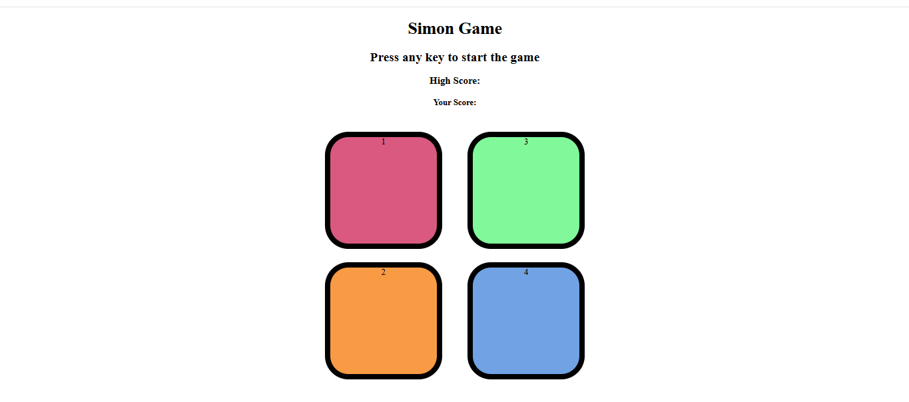
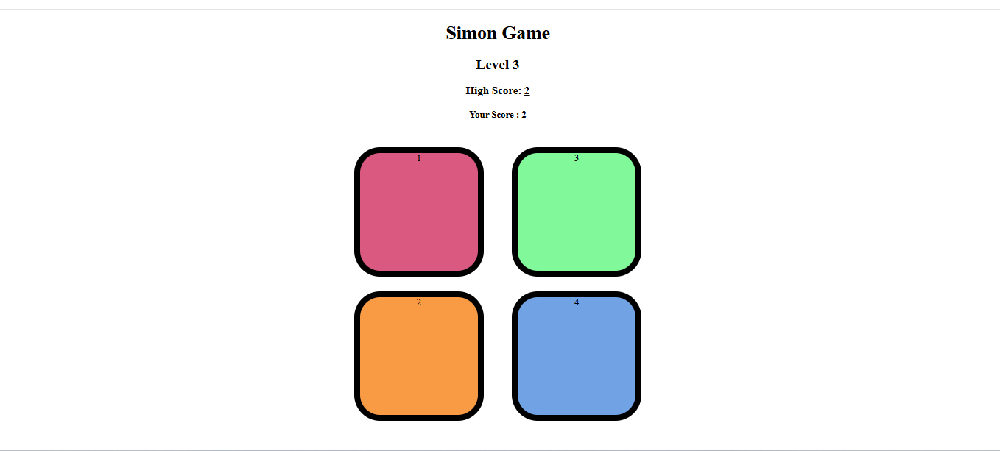
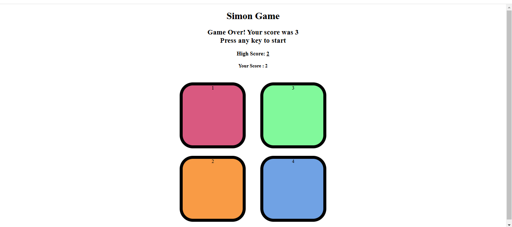

# Simon Says Game

## Table of Contents
- [Introduction](#introduction)
- [Features](#features)
- [Technologies Used](#technologies-used)
- [How to Play](#how-to-play)
- [Installation](#installation)
- [Directory Structure](#directory-structure)
- [Screenshots](#screenshots)

---

## Introduction
The **Simon Says Game** is a memory-based game where the player must replicate a sequence of colors and sounds. As the game progresses, the sequence becomes longer, challenging the player's memory and reflexes. This project is built using **HTML**, **CSS**, and **JavaScript**, and is designed to work seamlessly on both desktop and mobile devices.

---

## Features
- Dynamic color and sound sequence generation.
- Animated buttons to enhance user experience.
- Tracks the highest score during the session.
- Easy-to-use interface.
- Responsive design for all screen sizes.

---

## Technologies Used
- **HTML**: Structure of the game.
- **CSS**: Styling and animations.
- **JavaScript**: Game logic and interactivity.

---

## How to Play
1. Start the game by pressing the "Start" button.
2. The game will highlight a color and play a sound. Memorize the sequence.
3. Repeat the sequence by clicking the buttons in the correct order.
4. With each round, the sequence grows longer.
5. If you make a mistake, the game ends, and your score is displayed.
6. Try to beat your highest score!

---

## Installation
1. Clone the repository:
   ```bash
   git clone https://github.com/{USERNAME}/SimonSaysGame.git
   ```
2. Navigate to the project directory:
   ```bash
   cd SimonSaysGame
   ```
3. Open the `index.html` file in any web browser.

---

## Directory Structure
```
SimonSaysGame/
|-- index.html
|-- styles/
|   |-- style.css
|-- scripts/
|   |-- script.js
|-- assets/
    |-- sounds/
    |   |-- green.mp3
    |   |-- red.mp3
    |   |-- yellow.mp3
    |   |-- blue.mp3
    |-- images/
        |-- screenshot1.png
        |-- screenshot2.png
```

---

## Screenshots
1. **Initial Screen**
   

2. **Gameplay**
   

3. **Game Over**
    

---

Enjoy the game and challenge your memory!

