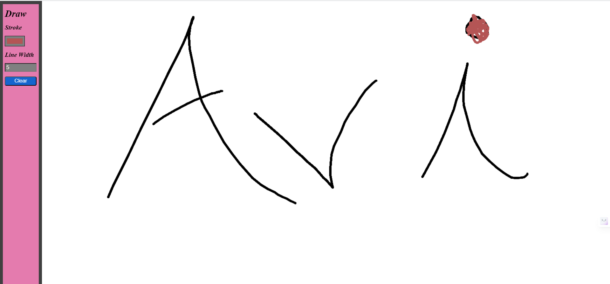

# Simple Drawing Game
This is a simple drawing game created using HTML, CSS, and JavaScript. Users can draw on the canvas using various tools provided in the toolbar.

# Features
- Drawing Canvas: The main canvas area where users can draw.
- Toolbar:
  - Stroke Color: Users can select the stroke color using a color input.
  - Line Width: Users can adjust the line width using a number input.
  - Clear Button: Clears the entire canvas.

# How to Use
- Open the index.html file in a web browser.
- Use the color picker to choose the stroke color.
- Adjust the line width using the provided input.
- Start drawing on the canvas.
- Click the "Clear" button to erase the entire canvas.

# Code Explanation
- The HTML file (index.html) contains the structure of the webpage, including the canvas and toolbar elements.
- The CSS file (style.css) provides styling for the webpage.
- The JavaScript file (index.js) contains the logic for drawing on the canvas and handling toolbar interactions.

# Dependencies
No external libraries or frameworks are used in this project. It runs using standard HTML, CSS, and JavaScript.

# How to Contribute
If you'd like to contribute to this project, feel free to fork the repository and submit a pull request with your changes.

# Demo Screenshot

# License
This project is licensed under the MIT License. Feel free to use, modify, and distribute the code as per the terms of the license.