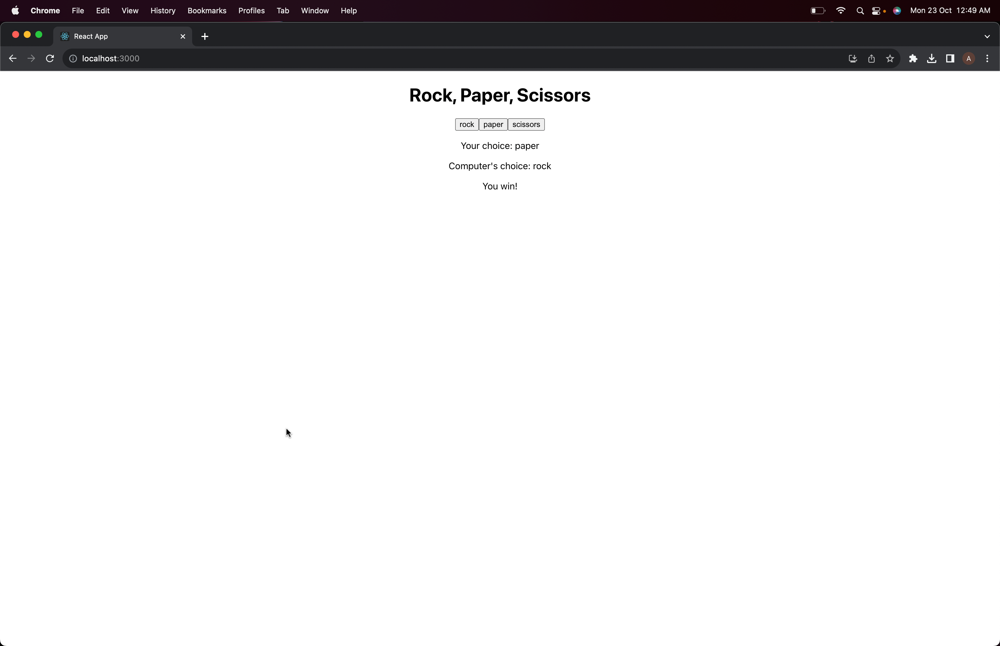

# Rock, Paper, Scissors Game

This is a simple Rock, Paper, Scissors game built using React. It allows users to play the classic hand game against the computer. Make your choice, see the computer's choice, and find out who wins!

## Technologies Used

- **React**: The project is built using React, a popular JavaScript library for building user interfaces. React provides a component-based architecture and facilitates the development of interactive web applications.

- **JavaScript**: JavaScript is used for the game's logic and to manage user interactions.

- **HTML/CSS**: The project includes HTML for structuring the webpage and CSS for styling the game.

## How to Play

1. Clone this repository to your local machine.

```bash
git clone https://github.com/your-username/rock-paper-scissors.git 
```
2. Navigate to the project directory.
```bash
cd rock-paper-scissors
```
3. Install dependencies using npm.
```bash
npm install
```
4. Start the development server.
```
npm start
```

This will launch the game in your web browser at http://localhost:3000.

Click on one of the available options: Rock, Paper, or Scissors.

The computer will make its choice, and the game will announce the winner for that round.

Play as many rounds as you like!



