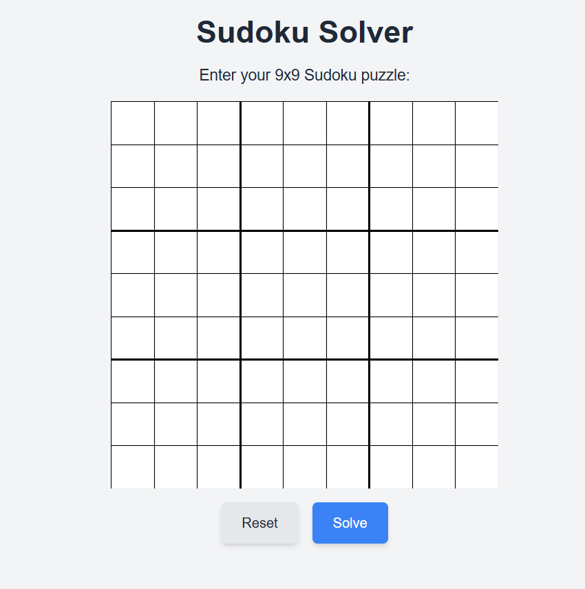
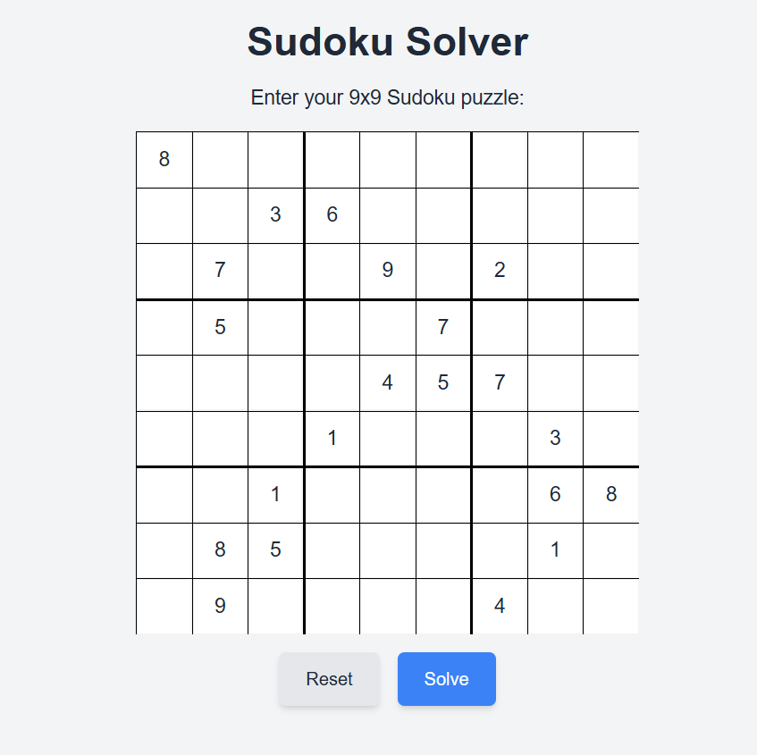
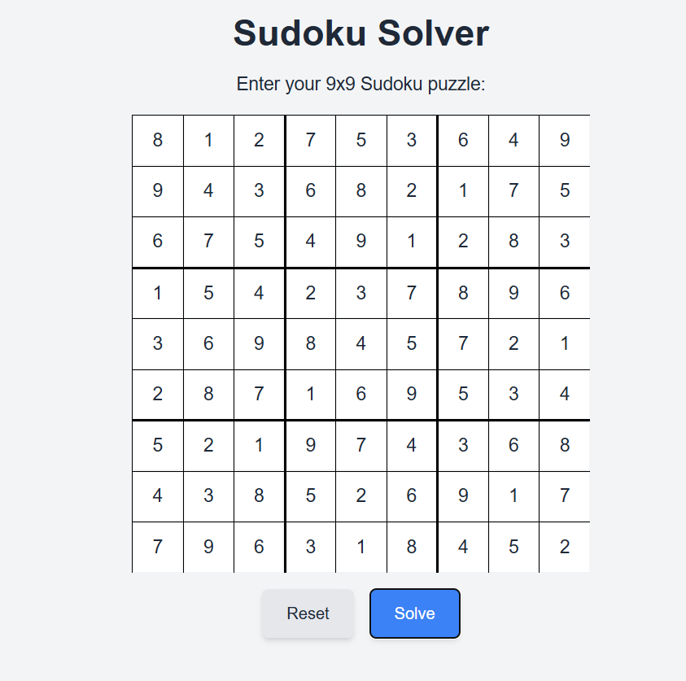

# Sudoku Solver

A web-based Sudoku Solver that allows users to input a 9x9 Sudoku puzzle and solve it with a single click. Built with HTML, CSS, JavaScript, and TailwindCSS.

## Features
- Interactive 9x9 Sudoku grid for input.
- Validates input to allow only numbers 1-9.
- Solves the puzzle instantly or alerts if no solution exists.
- Reset functionality to clear the grid.

## Tech Stack
- **Frontend**: HTML, TailwindCSS for styling.
- **Logic**: JavaScript for puzzle solving using a backtracking algorithm.

## File Structure
- `index.html`: Core structure of the webpage.
- `styles.css`: Styling for the Sudoku grid and buttons.
- `script.js`: Logic for solving the Sudoku puzzle and interactive functionalities.

## How to Use
1. Open `index.html` in your browser.
2. Enter numbers 1-9 in the grid (leave empty cells as blank).
3. Click **Solve** to see the solution or **Reset** to clear the grid.

## Algorithm
- Uses a backtracking approach to solve the Sudoku puzzle.
- Checks each cell to ensure compliance with Sudoku rules.

## Demo
Initial position

inputing a sudoku problem

submitting and generating a solution

---

