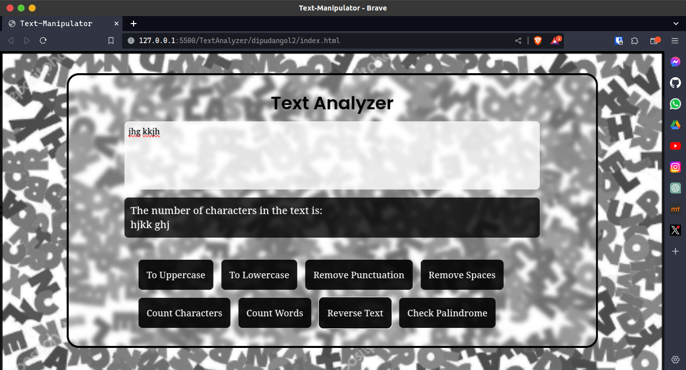

# Text Analyzer Web App

This is a simple web application built with HTML, CSS, and JavaScript that provides various text analysis features. It allows users to perform the following operations:

1. **Uppercase and Lowercase Conversion**:

   - Convert text to either all uppercase or all lowercase characters.

2. **Remove Punctuations**:

   - Remove all punctuation marks from the text.

3. **Remove Spaces**:

   - Remove all extra spaces from the text.

4. **Count Characters**:

   - Calculate the total number of characters in the text, excluding spaces.

5. **Count Words**:

   - Calculate the total number of words in the text.

6. **Reverse Text**:

   - Reverse the order of characters in the text.

7. **Check Palindrome**:
   - Determine whether the text is a palindrome (reads the same forwards and backwards).

## How to Use

1. Open the `index.html` file in your web browser.
2. Enter or paste the text you want to analyze in the provided text area.
3. Select the desired operation from the options provided.
4. You can run the webapp from dipudangol2.github.io/textanalyzer

## Preview

## Technologies Used

- HTML
- CSS (Tailwind CSS CDN)
- JavaScript
