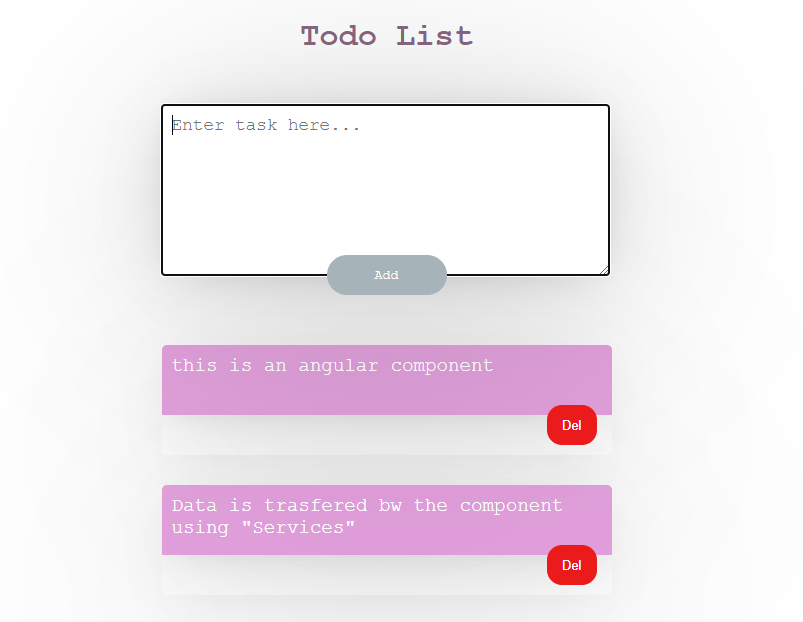

# ANGULAR TO-DO LIST

## Description

A to-do list made using **Angular (JS Framework)**.

There are two components in the app

1. `Get-task`:
   It includes the text area where the user writes the task
2. `Show-task`
   It includes all the tasks visible at the bottom

## Getting Started

You can run the project by replacing the src folder in your angular project. ✅
