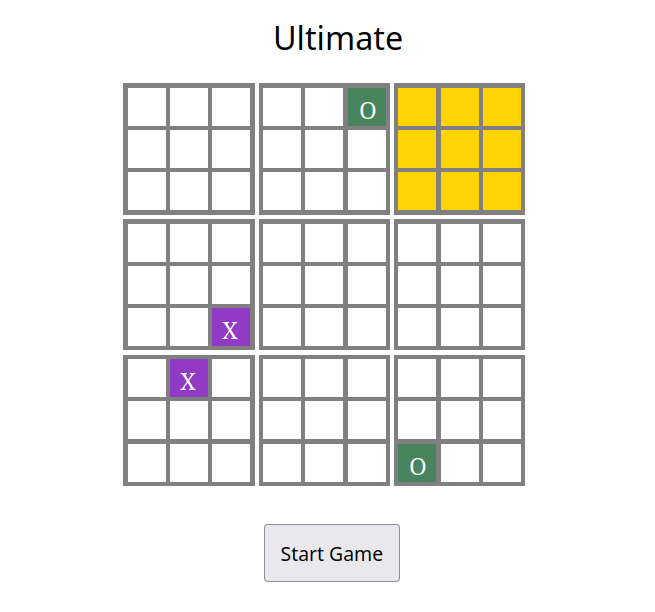
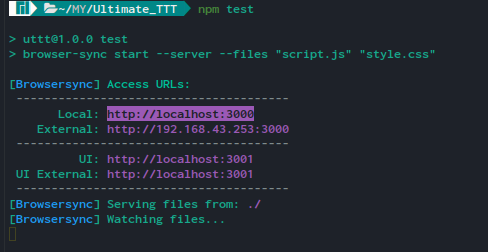

### Game Play
Ultimate Tic-Tac-Toe is a variant of the classic Tic-Tac-Toe game. It is played on a larger 9x9 grid which consists of nine 3x3 grids. The objective of the game is to win each 3x3 grid, and ultimately, the entire game by winning the most 3x3 grids.

In this game, players take turns placing their symbol (either X or O) in a vacant square of the 3x3 grid. However, the twist is that the square where a player places their symbol determines the 3x3 grid where their opponent must play on their next turn. If a player wins a 3x3 grid, they gain control of that grid, and their symbol is displayed in the corresponding square of the larger 9x9 grid. The game continues until one player wins three 3x3 grids in a row, or until all the squares have been filled, resulting in a draw.

Ultimate Tic-Tac-Toe is a more complex version of Tic-Tac-Toe that requires strategic thinking and planning ahead. It also introduces an element of control over the opponent's moves, as the placement of a player's symbol determines the next playable grid for their opponent. Overall, Ultimate Tic-Tac-Toe is an engaging and challenging game that provides a new twist on a classic game.

### Preview

[](https://user-images.githubusercontent.com/67221507/235636375-ae5099f8-9d22-4b33-9b81-8cf77bacbf4b.mp4)


### Usage

Make sure that

- You are in the project directory
- You have node and npm installed on your machine


1) Install dependencies
```
npm install
``` 

2) Run the server
```
npm test
```

3) Open the localserver at the given address



Enjoy playing.

### Features

Singleplayer with bot.
